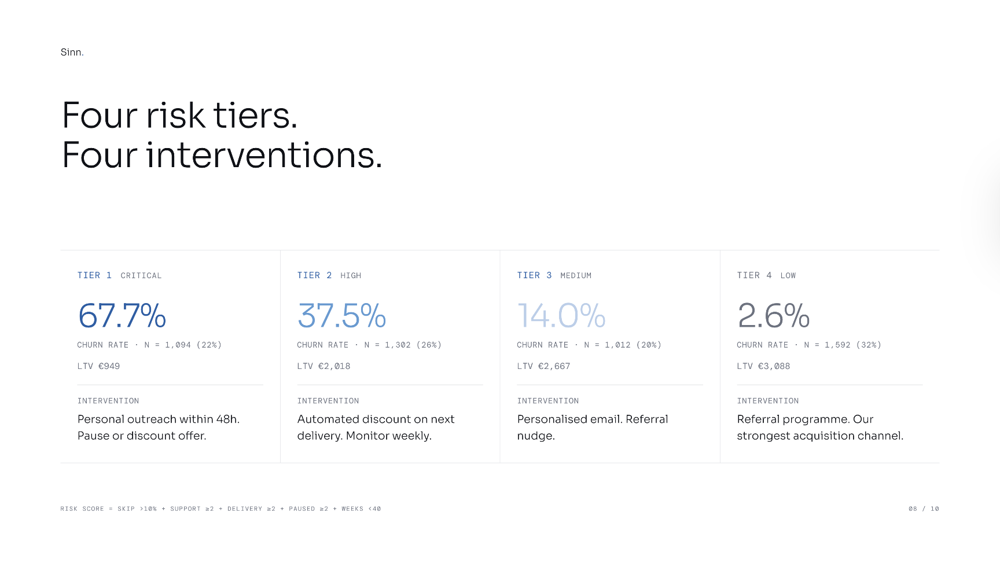

# MealKit Subscription Churn Analysis

One in four subscribers churn. €1.73M in lost lifetime revenue. This project looks at why, and what to do about it.

Built on a 5,000-subscriber dataset modelled on a European meal kit business. Analysis in BigQuery SQL, story in 10 slides.

---

## What the data says

**Paid social churns 5x more than referral.** 42.77% vs 8.23%. €1,200 LTV gap per customer.

**Free first box subscribers churn at 52%.** €1.47M in lifetime value gap across 981 subscribers.

**10% skip rate is the intervention threshold.** Churn jumps 6x when subscribers cross it.

**66% of churners are gone within 40 weeks.** The danger window is early.

**A risk model identifies 22% of subscribers at Critical risk** with 67.7% churn rate. Four tiers, four interventions.

**Retaining 10-30% of churners recovers €173K-€521K** in additional lifetime value.

---

## How it was built

Six phases of SQL analysis in BigQuery.

1. Overall snapshot
2. Segmentation by channel, discount, and plan
3. Cohort analysis by signup month
4. Behavioural drivers: skip rate, support contacts, delivery issues, pauses, tenure
5. Revenue impact and recovery modelling
6. Risk profiling with a five-signal model

Statistical significance validated via chi-square testing on key findings.

Tools: BigQuery, Python, Tableau, Figma, D3.js, React.

---

## Notes

The dataset is synthetic. Recovery calculations assume saved subscribers generate the LTV gap between active and churned averages. All projections should be validated through retention experiments before budget decisions.

---

## About

Built by Chirag Somashekar, a data analyst in Berlin. Presented under Sinn, a personal data storytelling practice.

The full story [presentation](presentation/churn_analysis.pdf/).
